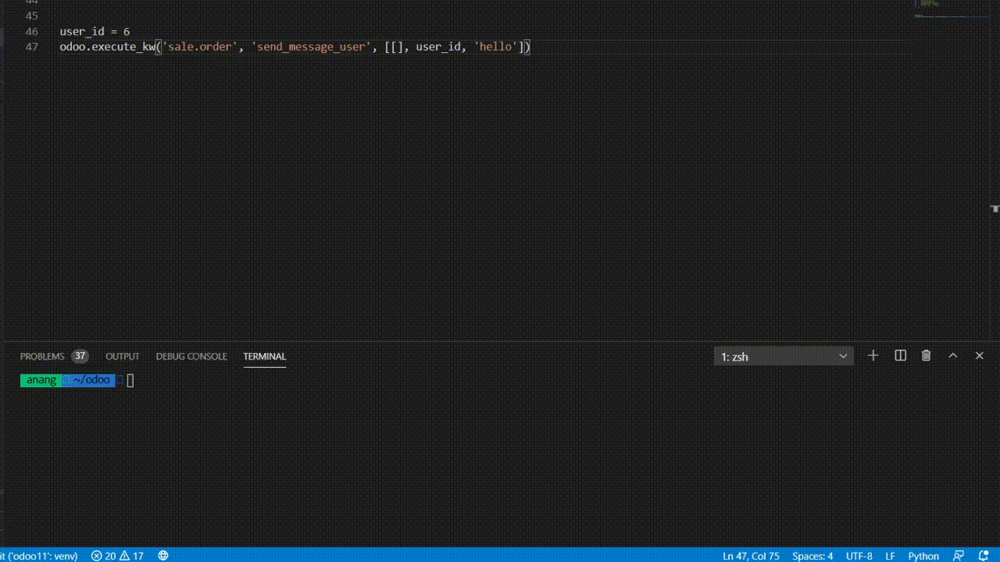

# send_message
Odoo module to make sending message easier


# Usage

```python
from odoo import api, models

class SaleOrderInherit(models.Model):
    _inherit = "sale.order"
    
    def action_confirm(self):
        result = super(SaleOrderInherit, self).action_confirm()
        # this example send message
        self.send_message_user(self.user_id.id, '{} is confirmed'.format(self.name))
        return result
```


# Demo

Call **send_message_user** from outside odoo using odoorpc




# TODO

- Send message to channel. as #general etc